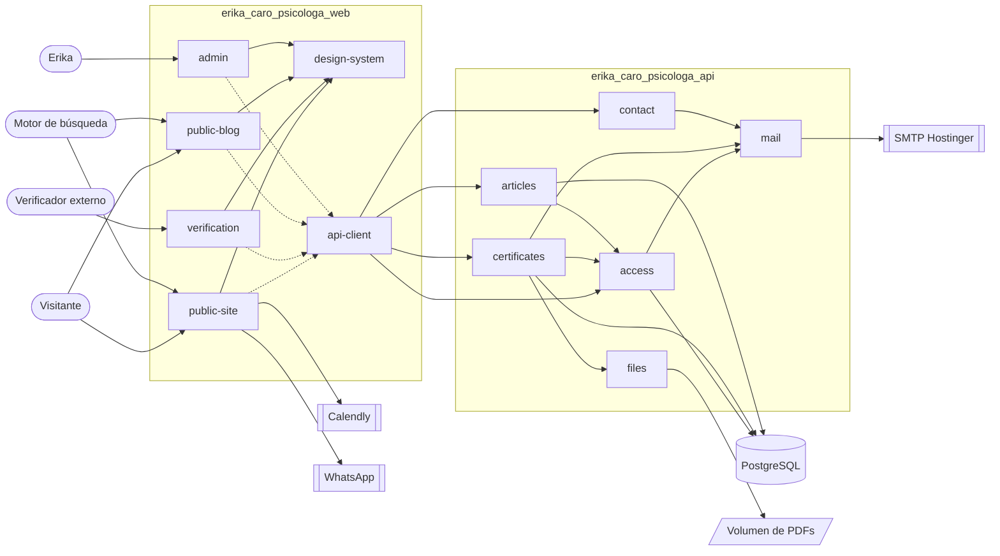
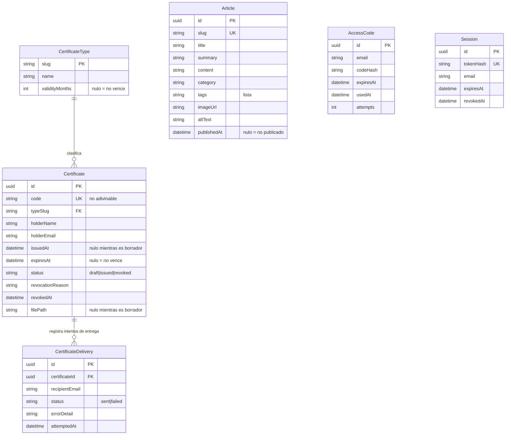

# Arquitectura: Erika Caro Psicóloga

> Este documento describe la arquitectura técnica del proyecto. La fuente de verdad del **stack** vive en `.specture/stack.yml`; este documento explica cómo se organiza el código sobre ese stack.
>
> Producido por la Fase 2 (`architecture`) el 2026-09-11, sobre `business_requirements.md` (Fase 1) y ADR-001 / ADR-002.

## 1. Stack de Referencia

- **Backend:** JavaScript + Express sobre Node 20
- **Base de Datos:** PostgreSQL con Prisma
- **Frontend:** React 18 + shadcn/ui (Radix) sobre Vite 4 y Tailwind 3, con React Router
- **Patrón Arquitectónico:** layered
- **Estrategia de Módulos:** by-feature en la API; el sitio público conserva su organización por capas (ver `.specture/conventions.md` §2)
- **Estilo de API:** REST, contrato en `docs/02-architecture/api-contract.openapi.yaml`
- **Convenciones detalladas:** ver `.specture/conventions.md`
- **Decisiones registradas (ADRs):** ADR-001 (stack adoptado), ADR-002 (backend, monorepo y navegación)

### Vista general

## 2. Componentes de Alto Nivel

> **Carpeta raíz:** `stack.yml.structure.root_layout` es `by-app-suffix` con `project.slug: erika_caro_psicologa`. Hay dos apps desplegables — `erika_caro_psicologa_api` y `erika_caro_psicologa_web` — y cada componente se declara con la carpeta de la app a la que pertenece, porque es el ancla de los paths de sus specs. Ningún componente de esta lista es desplegable por separado.

### 2.1 `access`
- **Responsabilidad:** identificar a Erika mediante un código de un solo uso enviado a su correo, y sostener su sesión mientras trabaja.
- **Carpeta raíz:** `erika_caro_psicologa_api`
- **Entradas:** `api-client` (solicitud de código, verificación de código, consulta y cierre de sesión); `certificates` y `articles` (comprobación de sesión en sus operaciones privadas).
- **Salidas:** `mail` (envío del código).
- **Datos que posee:** `AccessCode`, `Session`.
- **Dependencias permitidas:** `mail`.
- **Reglas que materializa:** `RN-004`, `CL-008`.

### 2.2 `certificates`
- **Responsabilidad:** todo el ciclo de vida de un certificado — generar su código de verificación **y el QR que lo representa**, recibir el PDF que Erika diseñó, emitirlo, archivarlo, anularlo y responder las consultas públicas de verificación. Es también quien **registra el resultado de cada intento de entrega** en `CertificateDelivery`, a partir de lo que `mail` le devuelve.
- **Carpeta raíz:** `erika_caro_psicologa_api`
- **Entradas:** `api-client` (emisión, archivo y anulación desde `admin`; verificación pública desde `verification`).
- **Salidas:** `mail` (entrega del certificado al titular), `files` (guardado y recuperación del PDF), `access` (comprobación de sesión en las operaciones privadas).
- **Datos que posee:** `CertificateType`, `Certificate`, `CertificateDelivery` — es el **único** componente que los escribe.
- **Dependencias permitidas:** `mail`, `files`, `access`.
- **Reglas que materializa:** `RN-001` a `RN-011`; casos `CL-005` (rechaza dejar emitido un certificado cuyo PDF no lleva impreso el código — es una invariante de la API, no una validación de pantalla), `CL-006`, `CL-007` (cada certificado es independiente: verificar uno no revela la existencia de otros del mismo titular), `CL-013` (una anulación posterior solo afecta a quien verifique después; no hay forma de notificar a quien ya verificó). También `CL-004`: el límite de consultas de verificación se aplica **aquí**, en la API, no en la pantalla — una pantalla no puede frenar a quien llame al endpoint directamente.

### 2.3 `articles`
- **Responsabilidad:** guardar y servir los artículos que Erika publica, y exponer el listado público filtrable.
- **Carpeta raíz:** `erika_caro_psicologa_api`
- **Entradas:** `api-client` (listado y lectura públicos; publicación desde `admin`).
- **Salidas:** `access` (comprobación de sesión al publicar).
- **Datos que posee:** `Article`.
- **Dependencias permitidas:** `access`.
- **Reglas que materializa:** `RN-018`.

### 2.4 `contact`
- **Responsabilidad:** recibir el mensaje del formulario público y hacerlo llegar al correo de Erika.
- **Carpeta raíz:** `erika_caro_psicologa_api`
- **Entradas:** `api-client` (envío del mensaje).
- **Salidas:** `mail`.
- **Datos que posee:** ninguno — el mensaje no se persiste. Ninguna regla de negocio lo exige y guardarlo crearía un depósito de datos personales sin propósito declarado, contra `RN-021`.
- **Dependencias permitidas:** `mail`.
- **Reglas que materializa:** `RN-015`.

### 2.5 `mail`
- **Responsabilidad:** único punto de salida de correo del sistema, contra el SMTP del dominio. **Devuelve** a quien lo llama el resultado de cada intento; no lo persiste ni decide qué hacer con él.
- **Carpeta raíz:** `erika_caro_psicologa_api`
- **Entradas:** `access`, `certificates`, `contact`.
- **Salidas:** SMTP de Hostinger (integración externa).
- **Datos que posee:** ninguno. **No accede a PostgreSQL.** Cada llamador decide qué hacer con el resultado: `certificates` lo persiste en `CertificateDelivery` (`CL-006`), mientras `access` y `contact` lo devuelven como error al usuario (§5.3) y lo dejan en el log.
- **Dependencias permitidas:** ninguna interna.
- **Reglas que materializa:** habilita `RN-008` y `RN-015`.

### 2.6 `files`
- **Responsabilidad:** guardar y recuperar los PDFs de certificados en el volumen persistente, sin exponerlos como contenido estático.
- **Carpeta raíz:** `erika_caro_psicologa_api`
- **Entradas:** `certificates`.
- **Salidas:** volumen del VPS.
- **Datos que posee:** los archivos PDF. La ruta de cada uno se guarda en `Certificate`.
- **Dependencias permitidas:** ninguna interna.
- **Reglas que materializa:** `RN-009`.

### 2.7 `design-system`
- **Responsabilidad:** tokens de marca y primitivas de interfaz compartidas por todas las pantallas. Se obtiene por ingeniería inversa de lo que ya existe (`frontend.ui_defined: true`), no se inventa.
- **Carpeta raíz:** `erika_caro_psicologa_web`
- **Entradas:** `public-site`, `verification`, `public-blog`, `admin` (todos lo consumen; la flecha va de la pantalla al sistema de diseño).
- **Salidas:** ninguna.
- **Datos que posee:** ninguno.
- **Dependencias permitidas:** ninguna.
- **Reglas que materializa:** `MK-001` a `MK-005` de `business_requirements.md`.

### 2.8 `public-site`
- **Responsabilidad:** las secciones de la landing, las páginas legales y el aviso de cambio de número. Es el contenido que sostiene el propósito del sitio: dar credibilidad.
- **Carpeta raíz:** `erika_caro_psicologa_web`
- **Entradas:** visitante, motor de búsqueda.
- **Salidas:** `design-system` (consume sus tokens y primitivas), `api-client` (solo para el formulario de contacto), Calendly y WhatsApp como enlaces externos.
- **Datos que posee:** ninguno. Su contenido es estático y versionado con el código.
- **Dependencias permitidas:** `design-system`, `api-client`.
- **Reglas que materializa:** `RN-012`, `RN-013`, `RN-014`, `RN-016` (es quien monta el formulario, así que es quien ofrece WhatsApp y el correo directo cuando el envío falla), `RN-017`, `RN-019`, `RN-020`, `RN-022`; caso `CL-011` (pasada la fecha límite no se muestra ningún aviso y todos los canales llevan el número nuevo).

### 2.9 `verification`
- **Responsabilidad:** la pantalla pública donde un tercero comprueba un certificado, sea por QR o escribiendo el código.
- **Carpeta raíz:** `erika_caro_psicologa_web`
- **Entradas:** verificador externo.
- **Salidas:** `design-system`, `api-client`.
- **Datos que posee:** ninguno.
- **Dependencias permitidas:** `design-system`, `api-client`.
- **Reglas que materializa:** `RN-002`, `RN-010` y `FA-005` (no ofrece descarga del certificado: si el titular lo perdió, la pantalla lo remite a Erika); casos `CL-001`, `CL-002`, `CL-003`, `CL-009`, `CL-012`.

### 2.10 `public-blog`
- **Responsabilidad:** listado filtrable de artículos y lectura de un artículo.
- **Carpeta raíz:** `erika_caro_psicologa_web`
- **Entradas:** visitante, motor de búsqueda.
- **Salidas:** `design-system`, `api-client`.
- **Datos que posee:** ninguno.
- **Dependencias permitidas:** `design-system`, `api-client`.
- **Reglas que materializa:** habilita `RN-018`; caso `CL-010`.

### 2.11 `admin`
- **Responsabilidad:** la zona privada de Erika — entrar con su código, emitir y anular certificados, consultar su archivo y publicar artículos.
- **Carpeta raíz:** `erika_caro_psicologa_web`
- **Entradas:** Erika.
- **Salidas:** `design-system`, `api-client`.
- **Datos que posee:** ninguno.
- **Dependencias permitidas:** `design-system`, `api-client`.
- **Reglas que materializa:** `RN-004`, `RN-005`, `RN-018`. Sobre `CL-005`: la invariante la hace cumplir `certificates` (§2.2); `admin` solo **presenta** el rechazo para que Erika corrija el diseño y vuelva a subir.

### 2.12 `api-client`
- **Responsabilidad:** único punto por el que el sitio habla con la API. Se genera a partir del contrato; ninguna pantalla arma URLs a mano.
- **Sin ubicación ni herramienta decididas todavía:** el mapa de `conventions.md` §2 no tiene slot para un cliente generado, y `stack.yml` no declara generador. La ubicación y el generador los cierra **Epic 2.1** del ROADMAP; las librerías de validación de §5.4 las cierra **Epic 1.6** (esqueleto de la API), dentro de Foundation. Hasta entonces `R-FILE-003` no tiene dónde ubicarlo — ver §7.
- **Carpeta raíz:** `erika_caro_psicologa_web`
- **Entradas:** `public-site`, `verification`, `public-blog`, `admin`.
- **Salidas:** la API.
- **Datos que posee:** ninguno.
- **Dependencias permitidas:** ninguna interna.

## 3. Patrones de Comunicación

| Origen | Destino | Mecanismo | Síncrono/Asíncrono | Notas |
|--------|---------|-----------|--------------------|-------|
| `public-site` · `verification` · `public-blog` · `admin` | `api-client` | Llamada de función | sync | Ninguna pantalla llama HTTP directamente. |
| `api-client` | `access` · `certificates` · `articles` · `contact` | HTTP/REST | sync | Cookie de sesión en las operaciones privadas. |
| `certificates` · `articles` | `access` | Llamada de función | sync | Comprobación de sesión en las operaciones privadas. `access` responde si la sesión es válida; nunca decide reglas de negocio del llamador. |
| `certificates` | `files` | Llamada de función | sync | El PDF se escribe antes de marcar el certificado como emitido. |
| `certificates` · `access` · `contact` | `mail` | Llamada de función | sync | Entrega en el mismo ciclo de petición. `mail` **devuelve** el resultado; el fallo no se traga: el llamador lo persiste (`certificates`) o lo devuelve como error (`access`, `contact`). |
| `mail` | SMTP Hostinger | SMTP | sync | Integración externa. Sin garantía de rebote — ver §7. |
| `access` · `certificates` · `articles` | PostgreSQL | Prisma | sync | Cada componente accede **solo** a las entidades que posee (§2). `mail` y `files` **no** acceden a PostgreSQL. |
| `files` | Volumen del VPS | Sistema de archivos | sync | Fuera de la raíz pública: nunca servido como estático. |
| `public-site` | Calendly · WhatsApp | Enlace externo | — | Salida del sistema: el visitante abandona el sitio. No hay integración. |

> **Restricción de despliegue — la cookie de sesión obliga a mismo origen.** ADR-002 despliega dos aplicaciones Dokploy separadas, pero la sesión de Erika viaja en una cookie `HttpOnly`. Para que funcione sin abrir CORS con credenciales, **la API se sirve bajo el mismo origen que el sitio**, en el prefijo `/api`. Es una condición del despliegue, no un detalle de infraestructura: si las dos apps terminan en orígenes distintos, el esquema de autenticación del contrato deja de ser válido y hace falta un ADR.
>
> **La API conoce la URL pública del sitio.** `certificates` construye la `verificationUrl` que el QR codifica (`RN-005`), así que necesita la dirección de la pantalla de verificación como configuración. Es un acoplamiento deliberado y **irreversible una vez impreso en un PDF**: cambiar esa ruta después invalida los QR ya emitidos. La ruta la fija **Epic 1.3** del ROADMAP (enrutado base); el `navigation_map.md` de la Fase 3 la documenta, no la decide. No puede cambiarse sin ADR a partir del primer certificado emitido.

> **Detalle a nivel de endpoint:** esta tabla describe la comunicación a nivel **componente**. El contrato endpoint-por-endpoint vive en `docs/02-architecture/api-contract.openapi.yaml` + su compañero legible `api-contract.md`. No se duplican endpoints aquí.

## 4. Modelo de Datos Inicial

### Entidades principales

- **`CertificateType`** — los cuatro tipos de `RN-011`. La vigencia vive **como dato**, no como código, precisamente porque `D-1` sigue abierta: fijar los meses después no exigirá una migración ni tocar la lógica. `validityMonths` nulo significa que ese tipo no vence.
- **`Certificate`** — el registro central. Nace como `draft` cuando Erika pide su código (`RN-005`) y pasa a `issued` cuando sube el PDF: un borrador nunca es verificable. El `code` es único y no derivable de otro (`RN-001`). Solo guarda los datos que `RN-007` permite — nombre, correo, tipo, fechas — y ningún dato clínico.
  > **`expired` no es un estado almacenado.** `status` guarda únicamente `draft`, `issued` o `revoked`; el vencimiento se **deriva** comparando `expiresAt` con el momento de la consulta. Guardarlo obligaría a un proceso que recorra la tabla cambiando estados, y un certificado quedaría mal clasificado hasta que ese proceso corriera.
- **`CertificateDelivery`** — un registro por intento de entrega, **escrito por `certificates`** a partir de lo que `mail` le devuelve. Existe para `CL-006`: sin él, un correo que no llega es invisible para Erika. Cubre solo la entrega de certificados; los envíos de OTP y del formulario de contacto no se persisten — su fallo vuelve como error al usuario en el mismo momento (§5.3), que es cuando importa.
- **`Article`** — un artículo del blog. `publishedAt` nula distingue lo no publicado de lo publicado; el listado público solo devuelve lo publicado.
- **`AccessCode`** — el OTP de Erika. Se guarda el hash, nunca el código. `attempts` limita el ensayo y error; `expiresAt` acota la ventana.
- **`Session`** — sesión activa, guardada como hash del token para que robar la base no dé sesiones válidas. `revokedAt` permite cerrar sesión de verdad.

> **El correo de Erika no es una entidad.** `FA-007` deja fuera de alcance tener más de una persona emisora, así que la dirección autorizada vive en configuración, no en una tabla de usuarios que hoy tendría exactamente una fila.

## 5. Cross-Cutting Concerns

### 5.1 Autenticación y Autorización
- **Estrategia:** código de un solo uso (OTP) enviado por correo, seguido de una sesión sostenida por cookie `HttpOnly`. Sin contraseñas (ADR-002).
- **Roles definidos:** dos, y solo dos. **Público** — visitante y verificador, sin identificación. **Administrador** — Erika, la única dirección autorizada (`RN-004`, `FA-007`).
- **Componente responsable:** `access`.
- **Regla de cobertura:** toda operación que escribe, o que lee datos que `RN-002` no permite mostrar al público, exige sesión de administrador. La verificación pública es la única lectura de certificados abierta, y devuelve únicamente lo que `RN-002` autoriza.
- **Resistencia al ensayo y error:** la solicitud de código responde igual exista o no la dirección, para no revelar cuál es la autorizada. Los intentos de verificación por código están limitados (`attempts` en `AccessCode`), igual que las consultas de verificación pública (`CL-004`).

### 5.2 Logging y Observabilidad
- **Niveles usados:** `error`, `warn`, `info`. Sin `debug` en producción.
- **Qué se loggea siempre:** fallos de envío de correo (`CL-006`), intentos de acceso fallidos, anulaciones de certificado, y todo error no controlado en el borde HTTP.
- **Qué NO se loggea, nunca:** el código OTP ni su hash, el token de sesión, el código de verificación de un certificado completo, el nombre o correo de un titular, y el cuerpo de los mensajes del formulario de contacto. Son datos bajo `RN-021`; un log es un lugar donde los datos sobreviven sin control de acceso.

### 5.3 Manejo de Errores
- **Estrategia primaria:** el borde HTTP traduce el fallo a un envelope único de error, definido una sola vez en el contrato. La lógica de negocio no arma respuestas HTTP.
- **Errores recuperables vs no recuperables:** recuperable es lo que el usuario puede corregir (código inválido, PDF sin código impreso, dirección mal escrita) y se responde con un `code` de negocio. No recuperable es el fallo de infraestructura, que se responde genérico y se loggea completo.
- **Códigos de error de negocio:** enumerados en el contrato de API. Ninguna capa los inventa por su cuenta.
- **Silencio prohibido:** un fallo de envío de correo no se traga. O vuelve como error al llamador, o queda en `CertificateDelivery` para que Erika lo vea.

### 5.4 Validación
- **Capa donde ocurre:** en el borde, sobre el shape del contrato, **y** en el servicio sobre las reglas de negocio. Lo primero rechaza lo malformado; lo segundo hace cumplir invariantes como "un borrador no se puede anular".
- **Librerías permitidas:** las que declare **Epic 1.6** del ROADMAP (esqueleto de la API). No se introduce ninguna sin pasar por él.

## 6. Boundaries y Restricciones

- [ ] Ninguna pantalla del sitio arma URLs de API a mano: todo pasa por `api-client`, generado desde el contrato.
- [ ] Ningún componente de presentación toca PostgreSQL ni el volumen de archivos.
- [ ] Cada componente de la API accede **solo** a las entidades que declara poseer en §2. `articles` no lee `Certificate`; `certificates` no lee `Article`.
- [ ] `mail` es el único componente que habla con SMTP. Nadie más envía correo, y `mail` no persiste nada: devuelve el resultado a quien lo llamó.
- [ ] Los PDFs viven fuera de cualquier raíz servida como estática. La única vía de acceso es una operación autenticada de Erika (`RN-009`). Ninguna operación pública devuelve un PDF, ni siquiera al titular (`RN-010`, `FA-005`).
- [ ] **La respuesta de verificación pública contiene exactamente:** el estado, el nombre del titular, y —según el estado— el motivo de **anulación** (`RN-006`, `CL-002`) o la fecha de vencimiento (`CL-003`). Nunca el PDF, nunca el motivo de **emisión** ni ningún dato clínico, nunca el correo del titular, nunca la existencia de otros certificados suyos (`CL-007`). El "motivo" que `RN-002` prohíbe es el de emisión; el que `RN-006` exige es el de anulación: son datos distintos y la prohibición no alcanza al segundo.
- [ ] Los códigos de verificación se generan con una fuente aleatoria criptográfica. Nunca a partir de un contador, una fecha, un nombre ni un hash de datos del titular (`RN-001`).
- [ ] Un certificado en estado `draft` no es verificable ni aparece en ninguna respuesta pública. Un PDF sin el código impreso no puede dejar un certificado emitido (`CL-005`), y esa comprobación vive en `certificates`, no en la pantalla.
- [ ] Un código que no corresponde a ningún certificado responde sin revelar por qué (`CL-001`). **Si además `anulado` y `vencido` deben ser indistinguibles de `no existe` es exactamente lo que `D-2` deja sin cerrar** (§7): hasta que se decida, el contrato modela los tres estados por separado.
- [ ] Las credenciales (base de datos, SMTP, dirección autorizada) se leen de variables de entorno. Nunca del repositorio.
- [ ] El copy clínico, los testimonios y las credenciales de Erika no se generan ni se reescriben (`RN-019`).

## 7. Decisiones Pendientes / Open Questions

> Heredadas de la Fase 1, más las que aparecen al diseñar. Cada una debe cerrarse antes del epic que depende de ella.

- [ ] **`D-1` — Vigencia por tipo de certificado (`RN-003`).** La arquitectura la deja como dato en `CertificateType.validityMonths`, así que no bloquea la construcción del modelo, pero sí bloquea poblar los tipos y calcular vencimientos.
- [ ] **`D-2` — Contradicción entre `CL-001` y `CL-002`/`RN-006`.** No se puede a la vez responder neutro ante cualquier código inválido y mostrar el motivo de anulación. **Bloquea el diseño de la respuesta de verificación**, que es la operación más expuesta del sistema. Hasta que se cierre, el contrato modela los tres estados por separado y deja la decisión anotada.
- [ ] **`D-3` — Ubicación del manual de marca (`MK-001`).** Bloquea la Fase 3, no esta.
- [ ] **`D-4` — Fecha de publicación del aviso de cambio de número (`RN-014`).** Bloquea el epic del aviso.
- [ ] **`D-5` — Edición y despublicación de artículos.** El contrato **no** incluye operaciones de edición ni de retiro, porque ninguna capacidad de frontera las origina. Si Erika las necesita, es una capacidad nueva y entra por `new-feature`.
- [ ] **`D-6` — Destino de los artículos de ejemplo existentes.** Hoy hay tres listas contradictorias con imágenes de banco. Bloquea el epic del blog.
- [ ] **`D-7` — Recuperación de acceso de Erika (`CL-008`).** El OTP la resuelve mientras su correo funcione. Queda sin respuesta el caso de que su correo deje de funcionar: no hay segunda vía.
- [ ] **Respaldo del volumen de PDFs y de PostgreSQL.** ADR-002 lo dejó anotado como consecuencia negativa sin resolver. Son documentos que Erika no puede perder; hace falta una política verificada, no una intención.
- [ ] **Visibilidad de rebotes con SMTP plano.** `CertificateDelivery` registra si el envío falló en el momento, pero un rebote posterior es invisible. `CL-006` queda parcialmente servido; si resulta insuficiente, migrar a un servicio de correo dedicado requiere ADR.
- [ ] **Ruta pública de la pantalla de verificación.** La fija **Epic 1.3** del ROADMAP (enrutado base) y la recoge después el `navigation_map.md` de la Fase 3; la API la necesita como configuración para construir el QR (§3). A partir del primer certificado emitido queda congelada: cambiarla invalida los QR impresos.
- [ ] **Ubicación y generador del `api-client`.** `conventions.md` §2 no tiene slot para un cliente generado y `stack.yml` no declara herramienta de generación. Lo cierra **Epic 2.1** del ROADMAP, que debe además añadir la fila al mapa de ubicaciones — si no, `R-FILE-003` no tiene dónde ubicarlo.
- [ ] **Indexación del contenido (`HU-SITE-008`).** React Router da direcciones reales, pero la aplicación se renderiza en el navegador. Falta decidir cómo se garantiza que un buscador vea el contenido del blog y de la landing.

---

*Este documento debe ser actualizado al cierre de cada Milestone si la arquitectura evolucionó. Cualquier cambio significativo debe quedar registrado en un ADR en `.specture/decisions/`.*
